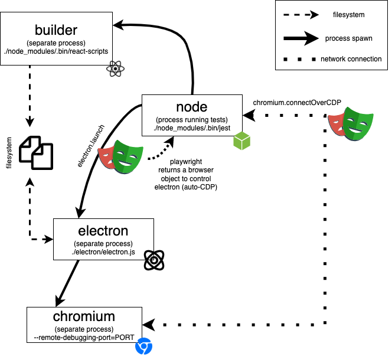
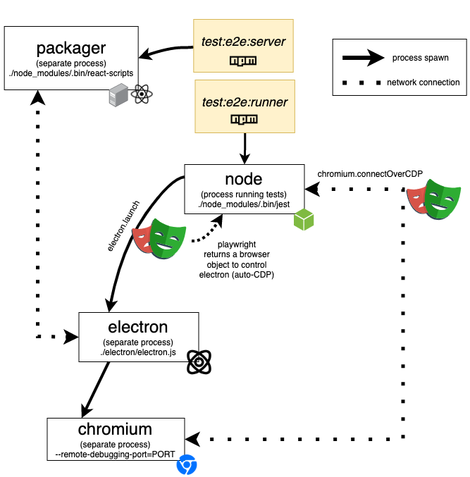
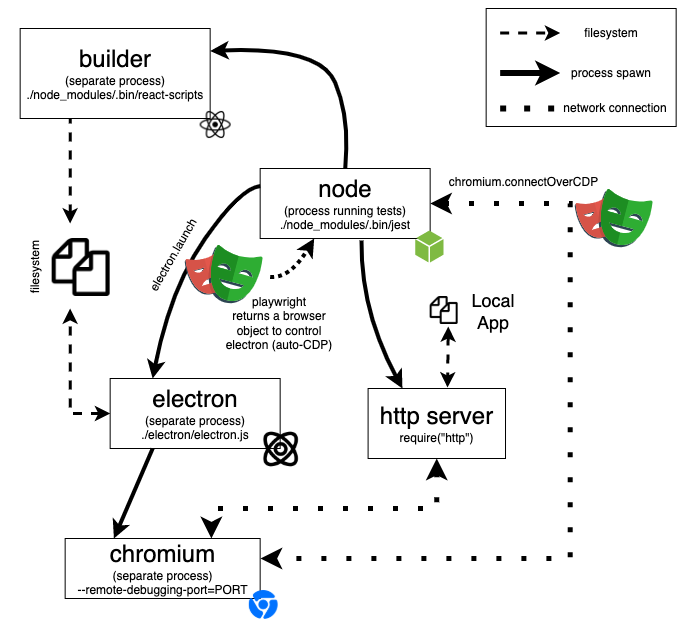

# E2E Testing Infrastructure

This document covers our E2E testing infrastructure, and how it runs on CI.

# The E2E test infrastructure

There are two ways of running E2E tests for the Synthetics Recorder:

* All-in-one (`npm run test:e2e`) - When running tests using the `test:e2e` script, **Jest will trigger a rebuild of the application for every test run** and those will be used to run all tests.
* Server and runner (`npm run test:e2e:server` and `npm run test:e2e:runner`) - By running the `test:e2e:server` script first, you'll start a server which does an incremental build of your application every time you change a file. The `test:e2e:runner` then causes the tests to use the application files served by that server instead of having to rebuild all of them from scratch.
  Running tests in this way is good if you want to iterate quickly and debug E2E tests instead of having to rebuild everything everytime.

Regardless of which way of running tests you choose, our tests will start a local application against which they'll run tests.

## All-in-one E2E tests

The diagram below outlines what happens and which processes get spawned when running `npm run test:e2e`.

As you can see in the image above, these are the main steps necessary for running E2E tests:

1. Building the recorder application itself.
    The Jest setup file will kick-off a build using the `react-scripts` executable. That executable will generate a build which goes into a static folder from which our Electron app will read.
2. Running Electron
    In our tests, we'll launch Electron instances using `playwright.launch`. This command keeps a reference to the Electron instance via Playwright (using the [`Chrome DevTools Protocol`](https://chromedevtools.github.io/devtools-protocol/)), which will automatically connect to it so that we have remote-control capabilities. We can use this reference to perform actions within our tests.
    The `electron` application, by default, will use the `electron` executable to open the `electron.js` script, which creates a new `electron` main process, sets up IPC listeners to respond to actions from the renderer process, and loads the application from the target build folder to which the builder in step (1) has written its files.
3. Controlling the remote browser
    Because the `chromium` process spun up by `electron` is within the separate process which was initially spun up by `node` (see the diagram above), we can't simply use `jest` to intercept the `chromium.launch` call and keep references to the launched browsers. Instead, what we did was to pass a parameter to ensure the `chromium` instance we open will have a remote port through which we can connect. Once connected, we can speak to that browser using the [`Chrome DevTools Protocol`](https://chromedevtools.github.io/devtools-protocol/).
    Now, just using the CDP would be quite annoying if we had to do it manually, so we use `playwright`'s `connectOverCDP` to actually get a `browser` instance (just like the `electron` one) on which we can call methods which will drive the remote chromium instance.

## Server and runner

The diagram below outlines what happens when executing the `server` and `runner` separately, through the `npm run test:e2e:server` and `npm run test:e2e:runner` commands.

As you can see in the image above, these are the main steps necessary for running E2E tests:

1. Starting the server
    Running `npm run test:e2e:server` starts the server which will incrementally rebuild the application when it detects changes and serve the built application to our test Electron instance.
    Behind the scenes, this script will simply run `react-scripts start` and give it a test `PORT`.
2. Starting a standalone runner
    Differently from what happens when running the `test:e2e` script, the standalone runner started by the `test:e2e:runner` script will _not_ try to rebuild the whole application every time it runs. It will simply connect to the server which serves the recorder application.
    Because that server does incremental rebuilds as soon as it detects changes, you'll be able to iterate much more quickly.
3. Controlling the remote browser
    Similarly to what happens when running the `test:e2e` script, we also control the separate Chromium instance started by Electron using the [`Chrome DevTools Protocol`](https://chromedevtools.github.io/devtools-protocol/) through Playwright.

## The bundled local app

In our tests, we must connect to a _local_ application over which we have full-control. We must use a local application so that we can avoid having failing tests in case any third-party changes websites upon which we depend.

The diagram below outlines how our tests connect to the bundled local app.

As you can see in the diagram above, all we do to connect to that local app is to use a Jest setup hook to kick-off a server which will serve the `Next.js` app bundled within this repository. Our tests then simply access that application through `localhost` and the bound port.

# Running E2E tests on CI

When running end-to-end tests on your machine, you're unlikely to find any problems when it comes to opening Electron instances, and starting Chromium windows. **On the other hand, when end-to-end tests run on CI, they run on agents which do not have a "display" to which things can be rendered. Because there's no "display" in a headless CI agent, it will fail to open Electron and Chromium, and thus end-to-end tests will fail.**

To solve this problem, we have to use a "fake display" to which we can render these applications. This fake display is created by a program called [`Xvfb`](https://en.wikipedia.org/wiki/Xvfb).

This program will start an "X server", which is essentially a program that can manage the content of a graphical display. This server can handle multiple displays, and whenever you see a graphical interface in a Linux machine, you're essentially just using a client which connects to an X server.

The beautiful aspect of having an X-Server is that you have a modular and reusable system through which clients can present users with a graphical interface. When you use a VNC client, for example, you might have seen that you specify a "display" so that the VNC client window can show you with a GUI. That `display` is an X display, and your VNC client is essentially just rendering whatever the remote X server on the host tells it to render.

> For more details on how X works, see [this post](https://medium.com/mindorks/x-server-client-what-the-hell-305bd0dc857f).

Now, when it comes to actually _running_ the tests, we install an X server within a docker image, and, within our Jenkins pipeline file, we set the `DISPLAY` variable to match a particular display we'll create using `Xvfb`. This `DISPLAY` environment variable then gets used by Electron (by default, if we pass it to `playwright.launch`) to know where to render its contents to.

Other important details that one must observe when maintaining our CI test infrastructure are:

* Installing `nvm`, and using the `.nvmrc` file to install the correct node version. Otherwise, we'll either not have Node available, or we'll have to keep updating the base image so that it contains the correct Node version.
* Reinstalling dependencies within the container. We can't simply use a copy `node_modules` within the container because there are native dependencies (like Electron, for example), and those will _not_ run properly if the underlying host's platform who first installed dependencies is not the same as the one for the container's base image.
* You _must_ run `npm` using `bash` on CI, otherwise, you'll not have `nvm` properly setup, as its setup happens on `~/.bashrc`.
